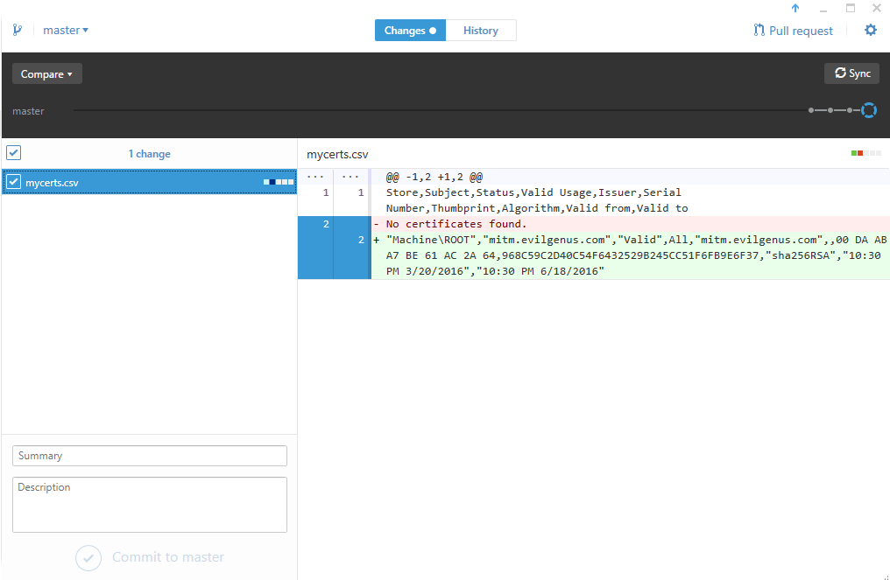

# Installed Certificates Checker
## Summary
The excellent [sigcheck](https://technet.microsoft.com/en-us/sysinternals/bb897441.aspx) Windows Sysinternals tool can identify currently installed certificates and more specifically, any that are not rooted by a certificate on the trusted Microsoft root certificate list.

This is useful when hunting for [Superfish](https://en.wikipedia.org/wiki/Superfish) like certificates that could be used to intercept encrypted communication.  

Combining the output of the sigcheck tool with a git repo can provide a history of changes and allows reuse of git tools to easily compare the diffs.

## Guide
1.  Create a git repo (or clone this one)
2.  Download Sigcheck (Windows Sysinternals Tool) from https://technet.microsoft.com/en-us/sysinternals/bb897441.aspx
3.  Unzip Sigcheck tool into the git repo
4.  Open command prompt where sigcheck is located
5.  Execute the following command: sigcheck -q -tv -c > mycerts.csv
6.  The v option ensures that only certificates not rooted to Microsoft's trusted list will be in the ouput (leave it off if you want all certs in the output) 
7.  Examine mycerts.csv (ideally the first line will be column headers and the next line will say: No certificates found.)
8.  Compare diffs using a git tool like https://desktop.github.com/ (see screenshot below)
9.  Commit mycerts.csv to the git repo
10.  Periodically redo steps 4 through 9


## Example Evil Certificate and Testing the Diff
1.  Use an example evil self-signed certificate or generate one using the command: openssl req -x509 -newkey rsa:2048 -keyout key.pem -out evilcert.pem -days 90 -nodes
2.  Import the certifcate into your machine under "Trusted Root Certification Authorities"
3.  Rerun the same sigcheck command to overwrite the mycerts.csv file
4.  Compare the diff using git with the following command: git diff mycerts.csv
```
diff --git a/mycerts.csv b/mycerts.csv
index ed709fb..cb5d810 100644
--- a/mycerts.csv
+++ b/mycerts.csv
@@ -1,2 +1,2 @@
 Store,Subject,Status,Valid Usage,Issuer,Serial Number,Thumbprint,Algorithm,Valid from,Valid to
-No certificates found.
+"Machine\ROOT","mitm.evilgenus.com","Valid",All,"mitm.evilgenus.com",,00 DA AB A7 BE 61 AC 2A 64,968C59C2D40C54F6432529B245CC51F6FB9E6F37,"sha256RSA","10:30 PM 3/20/2016","10:30 PM 6/18/2016"
```
5.  Notice the the line "No certificates found" was removed and a new certificate was found that was not rooted in Microsoft's trusted list (and the evil "genus" is not good at spelling).
6.  The GitHub Desktop tool shows this change by simply selecting mycerts.csv in the list of changed files.
